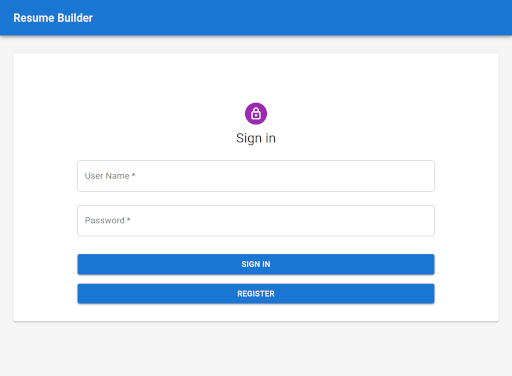
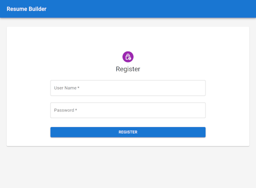
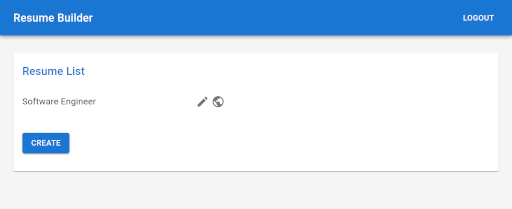
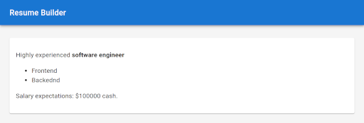

# Resume Builder

Прототип сервиса создания резюме. Оценка современных стэков web разработки.

Текущая реализация
- База данных MySQL
- Backend на Flask
- Frontend на [React](https://react.dev/) с [MUI](https://mui.com/)
- Текст рендерится markdown

# Запуск
```
docker-compose up -d --build
# Создать таблиц в базе данных
docker exec -it resume-backend python app.py
```

Открыть http://localhost

# Запуск отладочной версии
```
cd backend
docker run -d --rm -e MYSQL_ALLOW_EMPTY_PASSWORD=true -e MYSQL_DATABASE=resume -p 3306:3306 mysql
python3 app.py
```

```
cd backend
pip3 install -r requirements.txt
flask run --debug
```

```
cd frontend
npm install
npm start
```

# Тесты
```
DB_SERVER=127.0.0.1 python3 -m unittest
```

# Скриншоты





