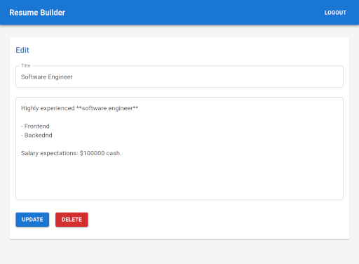

# Resume Builder

Прототип сервиса создания резюме. Оценка современных стэков web разработки.

Текущая реализация
- База данных MySQL
- Backend на Flask
- Frontend на [React](https://react.dev/) с [MUI](https://mui.com/)
- Текст рендерится markdown

# Запуск
```docker-compose up -d```

Открыть http://localhost

# Скриншоты




